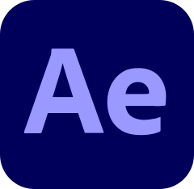

# Hi there 👋, welcome to my profile!

I'm a Full Stack Web Developer with experience in designing, building, testing, deploying, and maintaining scalable and robust websites and web applications.

## Languages & Frameworks

    
    
    
    
    
    
    
    
    
    
    

## Tools

    
    
    
    
    
    
    
    

## Get in touch

[Portfolio](https://www.nanadua.com/)  
<a href="mailto:nanadua11@outlook.com">Email</a>  
[Dribbble](https://www.dribbble.com/nanadua96)  
[LinkedIn](https://www.linkedin.com/in/nana-dua)
